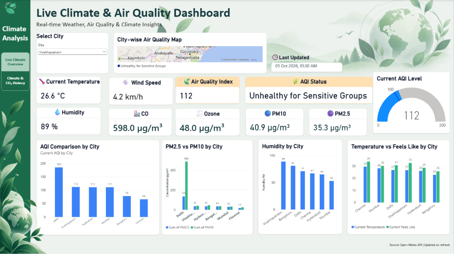
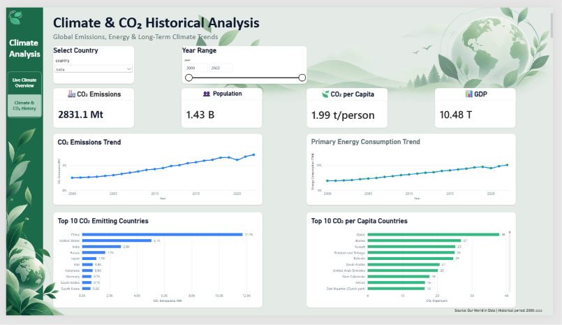

# Climate & Air Quality Analytics Dashboard

A two-page Power BI project that combines current weather and air-quality monitoring with historical climate and CO₂ analysis.

## Dashboard Preview

### Live Climate & Air Quality Overview

### Climate & CO₂ Historical Analysis

## Project Overview

I created this dashboard to analyze current weather and air-quality conditions for selected Indian cities and also explore long-term climate trends.

The first page focuses on current weather, AQI and pollutant levels, while the second page analyzes historical CO₂ emissions, population, GDP and primary energy consumption.

## Tools Used

- Power BI
- Power Query
- DAX
- Open-Meteo API
- Our World in Data

## Key Features

- Current temperature, humidity and wind-speed monitoring
- AQI status and conditional formatting
- PM2.5, PM10, ozone and carbon monoxide analysis
- City-wise air-quality comparison
- Historical CO₂ emissions analysis
- Primary energy consumption trends
- Top CO₂ emitting countries
- Top CO₂ per capita countries
- Country and year slicers
- Interactive page navigation

## Data Sources

- Open-Meteo API — weather and air-quality data
- Our World in Data — historical climate, CO₂, population, GDP and energy data

## Skills Practiced

- Data cleaning with Power Query
- DAX measures
- API data integration
- Data visualization
- Dashboard design
- Conditional formatting
- Slicers and visual interactions
- Trend and comparison analysis

## Power BI File

The complete Power BI project file is available in this repository:

`Climate_Air_Quality_Project.pbix`
